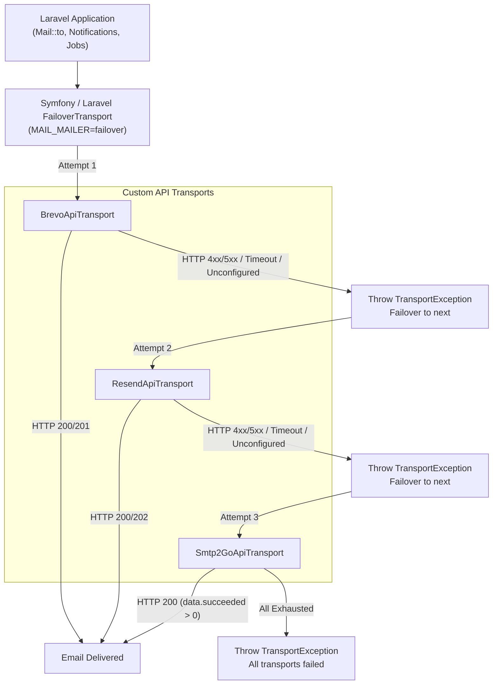

# Laravel Mailer

Zero-SDK REST-based email transport drivers (**Brevo**, **Resend**, and **SMTP2GO**) with plug-and-play native failover for Laravel 13+.

---

## Overview

`eudeka/laravel-mailer` is a drop-in Laravel package that registers lightweight, REST-based mail drivers for popular email providers without requiring vendor SDKs. It integrates directly with Symfony and Laravel's native `failover` mail transport, enabling resilient multi-provider email delivery with safe configuration caching.

### Key Highlights

- **Plug and Play**: Simply install via Composer and set environment variables in `.env`—no configuration publishing required.
- **Zero External SDKs**: Built purely on Laravel's built-in `Illuminate\Support\Facades\Http` client and `symfony/mailer` core components—zero vendor bloat and no PSR/Guzzle version conflicts.
- **Native Failover Integration**: Leverages Symfony's `FailoverTransport` automatically via `Mail::extend()` and dynamic provider resolution.
- **Safe Config Caching**: All `.env` mappings are encapsulated within internal configuration (`config/mailers.php`) to ensure complete compatibility with `php artisan config:cache`.
- **Automated Setup Helper**: Includes `php artisan eudeka:mailer-install` to automatically patch host application `config/mail.php` failover settings and populate `.env` / `.env.example`.

---

## How It Works



---

## Installation

Because `eudeka/laravel-mailer` is hosted in a private repository, configure Composer to recognize the repository before requiring it.

### 1. Register Private VCS Repository

Run via CLI (recommended to avoid JSON syntax errors):

```bash
# Option A: SSH (Default & Recommended)
composer config repositories.laravel-mailer vcs git@github.com:eudeka/laravel-mailer.git

# Option B: Fallback via HTTPS + GitHub Personal Access Token (PAT)
composer config repositories.laravel-mailer vcs https://github.com/eudeka/laravel-mailer.git
composer config --global github-oauth.github.com <YOUR_GITHUB_TOKEN>
```

Alternatively, add the repository directly to your application's `composer.json`:

```json
"repositories": [
    {
        "type": "vcs",
        "url": "git@github.com:eudeka/laravel-mailer.git"
    }
]
```

### 2. Require Package with SemVer

Install using a semantic version constraint:

```bash
composer require "eudeka/laravel-mailer:^1.0"
```

> [!IMPORTANT]
> **Always use SemVer version constraints (e.g., `^1.0` or a specific release tag)**. Do not use `dev-main` in consuming applications to prevent unexpected breaking changes and ensure reproducible builds across CI and team environments.

### 3. Run Automated Setup Command

Run the interactive installer to configure your host application's `config/mail.php` failover definition and populate `.env` and `.env.example`:

```bash
php artisan eudeka:mailer-install
```

---

## Configuration

The package is **zero-config**. Configuration files do not need to be published unless you wish to customize defaults.

### 1. Environment Variables (`.env`)

Set `MAIL_MAILER` to `failover` (or a specific driver) and supply your API keys:

```env
# Default Mailer
MAIL_MAILER=failover

# Sender Identity
MAIL_FROM_ADDRESS="noreply@yourdomain.com"
MAIL_FROM_NAME="${APP_NAME}"

# Failover Provider Sequence (comma-separated, in priority order)
MAIL_FAILOVER_MAILERS=brevo,resend,smtp2go

# Provider API Keys
MAILER_BREVO_API_KEY=xkeysib-123456789abcdef
MAILER_RESEND_API_KEY=re_123456789abcdef
MAILER_SMTP2GO_API_KEY=api-123456789abcdef
```

> [!NOTE]
> For backward compatibility, legacy environment variables (`BREVO_API_KEY`, `RESEND_API_KEY`, `SMTP2GO_API_KEY`, and `FAILOVER_MAILERS`) are also respected as fallbacks.

### 2. (Optional) Custom Driver Configurations

If your project requires dedicated endpoints or custom timeouts, define them in your application's `config/mail.php`:

```php
'mailers' => [
    'resend-marketing' => [
        'transport' => 'resend',
        'key' => env('MAILER_RESEND_API_KEY'),
        'timeout' => 15,
    ],
],
```

---

## Usage

Use Laravel's standard mail APIs exactly as you normally would.

### Standard Mailables

```php
use App\Mail\OrderShippedMailable;
use Illuminate\Support\Facades\Mail;

// Synchronous dispatch
Mail::to('customer@example.com')->send(new OrderShippedMailable($order));

// Queued dispatch
Mail::to('customer@example.com')->queue(new OrderShippedMailable($order));
```

### Specific Mailer

Dispatch via a specific provider on demand:

```php
Mail::mailer('brevo')->to('customer@example.com')->send(new OrderShippedMailable($order));
```

### Attachments & Embedded Images

Standard attachments and inline images work out of the box:

```php
public function attachments(): array
{
    return [
        Attachment::fromPath(storage_path('invoices/inv-001.pdf'))
            ->as('invoice.pdf')
            ->withMime('application/pdf'),
    ];
}
```

Embedded images in Blade views are automatically Base64-encoded and attached according to each provider's REST schema:

```html
embed(public_path('images/logo.png')) }}" alt="Logo" />
```

### Tags & Custom Headers

Attach tags and metadata using standard Symfony message headers in your Mailables:

```php
use Illuminate\Mail\Mailable;

class OrderConfirmationMailable extends Mailable
{
    public function build(): self
    {
        return $this->subject('Order Confirmation')
            ->html('<p>Thank you for your order!</p>')
            ->withSymfonyMessage(function ($email) {
                // Tags
                $email->getHeaders()->addTextHeader('X-Tag', 'orders, transactional');

                // Custom Headers
                $email->getHeaders()->addTextHeader('X-Entity-ID', '12345');
            });
    }
}
```

---

## AI Coding Agent Integration (`AGENTS.md`)

If your consumer application uses AI coding agents (such as Antigravity, Cursor, Claude Code, or GitHub Copilot), add the following section to your application's `AGENTS.md`, `.cursorrules`, or workspace rules so AI agents adopt the package accurately:

```markdown
### Email & Mailers (eudeka/laravel-mailer)

- Multi-vendor email delivery with automatic failover is handled by `eudeka/laravel-mailer` (Brevo, Resend, SMTP2GO).
- Use standard Laravel 13 `Mail` facade and Mailables (`Mail::to()->send()` or `->queue()`).
- DO NOT install vendor SDKs (`resend/resend-php`, `getbrevo/brevo-php`) or invoke custom facades.
- In tests, use `Mail::fake()` for standard business logic assertions and `MAIL_MAILER=log` for local development.
- For complete adoption rules, see `vendor/eudeka/laravel-mailer/resources/boost/skills/laravel-mailer-development/SKILL.md`.
```

> [!TIP]
> If your application uses **Laravel Boost**, the bundled skill under `resources/boost/skills/laravel-mailer-development/SKILL.md` is automatically indexed by the Boost MCP server upon package installation.

---

## Testing & Local Development

### 1. Local Development (`MAIL_MAILER=log`)

To prevent burning third-party API quotas during local development, set your driver to `log` in `.env`:

```env
MAIL_MAILER=log
```

Emails will be written to `storage/logs/laravel.log` without contacting external REST endpoints.

### 2. Application Logic Testing (`Mail::fake()`)

Use standard Laravel `Mail::fake()` in your consumer application feature tests:

```php
use App\Mail\OrderShippedMailable;
use Illuminate\Support\Facades\Mail;

it('sends an order confirmation email', function () {
    Mail::fake();

    // Trigger your business logic here...

    Mail::assertSent(OrderShippedMailable::class, function ($mail) {
        return $mail->hasTo('customer@example.com');
    });
});
```

### 3. Failover Verification (`Http::fake()`)

To test that failover correctly switches providers upon external downtime, mock the provider endpoints with `Http::fake()`:

```php
use App\Mail\OrderShippedMailable;
use Illuminate\Support\Facades\Http;
use Illuminate\Support\Facades\Mail;

it('fails over to resend when brevo API is unavailable', function () {
    Http::fake([
        'api.brevo.com/*' => Http::response(['message' => 'Service Unavailable'], 503),
        'api.resend.com/*' => Http::response(['id' => 're_test_success'], 200),
    ]);

    Mail::to('user@example.com')->send(new OrderShippedMailable($order));

    Http::assertSent(fn ($request) => str_contains($request->url(), 'api.brevo.com'));
    Http::assertSent(fn ($request) => str_contains($request->url(), 'api.resend.com'));
});
```

---

## Package Development & Verification

For maintainers developing and testing `eudeka/laravel-mailer` itself:

```bash
composer test         # Run complete test and analysis pipeline
composer test:unit    # Run Pest test suite
composer test:types   # Verify 100% type coverage
composer analyse      # Run PHPStan static analysis
composer lint:check   # Check code style with Laravel Pint
composer lint         # Automatically format code with Laravel Pint
```

### Architecture & Adding New Transports

For developers or AI coding agents adding new email transports or extending the package, refer to the authoritative [Mail Transport Architecture & Extension Guide](docs/mail-transport-guide.md). It details the 8 core architectural invariants (zero-SDK REST, instant failover, idempotency, strict 2xx validation), the 10-step implementation workflow, and a ready-to-use boilerplate.

Detailed provider specifications, payload mappings, and API references:

- [Brevo Transport Specification](docs/providers/brevo.md)
- [Resend Transport Specification](docs/providers/resend.md)
- [SMTP2GO Transport Specification](docs/providers/smtp2go.md)
- [Provider Documentation Directory & Blueprint](docs/providers/README.md)

### Codebase Layout

```text
config/
└── mailers.php                            # Package internal configuration
src/
├── Commands/
│   └── MailerInstallCommand.php           # Artisan setup command (eudeka:mailer-install)
├── Transport/
│   ├── Concerns/
│   │   └── ExtractsEmailData.php          # Shared MIME, address & attachment normalization trait
│   ├── BrevoApiTransport.php              # Standalone Brevo REST transport
│   ├── ResendApiTransport.php             # Standalone Resend REST transport
│   └── Smtp2GoApiTransport.php            # Standalone SMTP2GO REST transport
└── LaravelMailerServiceProvider.php       # Provider registration and dynamic failover setup
```

---

## License

The MIT License (MIT). Please see [LICENSE.md](LICENSE.md) for more information.
