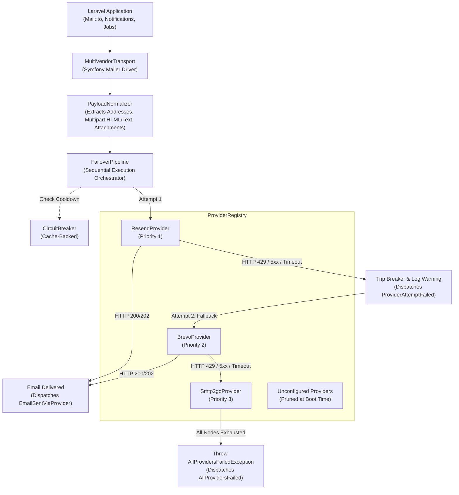
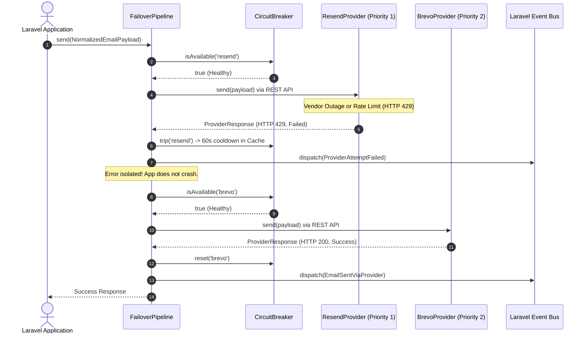

<div align="center">
    <h1>Laravel Multi-Vendor Email Provider</h1>
    <p>Zero-SDK REST-based email transport with dynamic runtime pruning, sequential failover, and cache-backed circuit breaker for Laravel 13+.</p>
</div>

<p align="center">
    <a href="https://packagist.org/packages/eudeka/email-provider"></a>
    <a href="https://packagist.org/packages/eudeka/email-provider"></a>
    <a href="https://badge.laravel.cloud/badge/eudeka/email-provider?style=flat" alt="Laravel versions"></a>
    <a href="https://github.com/eudeka/email-provider/actions"></a>
</p>

---

## Table of Contents

- [Why This Package?](#why-this-package)
- [Architecture & Core Concepts](#architecture--core-concepts)
- [Visual Architecture & Flow](#visual-architecture--flow)
- [5-Minute Quick Start](#5-minute-quick-start)
- [Local Development & Safe Testing](#local-development--safe-testing)
- [Day-to-Day Developer Cookbook](#day-to-day-developer-cookbook)
- [CLI Health & Diagnostics](#cli-health--diagnostics)
- [Events & Observability](#events--observability)
- [Configuration Reference](#configuration-reference)
- [Extending with Custom Providers](#extending-with-custom-providers)
- [Troubleshooting & Junior Dev FAQ](#troubleshooting--junior-dev-faq)
- [Running Package Tests](#running-package-tests)
- [License](#license)

---

## Why This Package?

In production applications, relying on a single email provider introduces a **single point of failure (SPOF)**. If your sole provider experiences an outage, enforces unexpected rate limits, or runs out of monthly credits, critical user communications—such as password resets, OTP tokens, and invoices—silently stall or crash background workers.

Typically, teams try to fix this by installing multiple official vendor SDKs (`resend/resend-php`, `brevo/brevo-php`, etc.). However, combining multiple third-party SDKs frequently leads to:
- **Dependency bloat and version conflicts** (conflicting Guzzle/PSR-18 versions or Symfony HTTP client requirements).
- **Fragile manual fallback code** scattered across mailers and queued jobs.
- **Wasted network hops** trying providers whose credentials are not even configured.

**`eudeka/email-provider` solves this natively at the transport layer for Laravel 13+.** It introduces a zero-SDK, resilient failover pipeline that plugs straight into Laravel's native mail system.

---

## Architecture & Core Concepts

This package is engineered around **five core architectural pillars**:

### 1. Zero-SDK Multi-Vendor Abstraction Layer
Provides a unified REST-based transport wrapper for **Laravel 13+**, abstracting multiple third-party email APIs (**Resend**, **Brevo**, and **SMTP2GO**) into a single internal dependency without vendor SDK bloat.
- Built strictly on Laravel's native `Illuminate\Support\Facades\Http` client.
- Zero external vendor SDK dependencies—no Guzzle version lockouts or package bloat.
- Implements Symfony's `TransportInterface` via [`MultiVendorTransport`](src/Transport/MultiVendorTransport.php), allowing existing `Mail::to()`, Mailables, and Notifications to work seamlessly without changing any application code.

### 2. Dynamic Execution Graph & Runtime Pruning
Parses global priority configurations during application boot. Any provider node missing valid API credentials is automatically pruned from the execution sequence, preventing redundant runtime checks and unnecessary network hops.
- Managed by [`ProviderRegistry`](src/Pipeline/ProviderRegistry.php).
- Only providers with valid API keys are considered "Active" and eligible for execution.
- If a provider's API key is left blank or omitted from `.env`, that provider is pruned ahead of time rather than failing on an expensive outbound HTTP request.

### 3. Payload Normalization Engine
Transforms standard outbound email payloads—including primary, carbon copy, and blind carbon copy recipient arrays, multipart text/HTML content, and Base64-encoded binary attachments—into vendor-compliant REST API JSON structures at the transport boundary.
- Executed by [`PayloadNormalizer`](src/Normalizer/PayloadNormalizer.php), transforming Symfony `Email` objects into an internal [`NormalizedEmailPayload`](src/DTO/NormalizedEmailPayload.php) DTO.
- Normalizes sender, `To`, `Cc`, `Bcc`, and `Reply-To` addresses with optional display names.
- Translates binary file attachments and inline embedded images (`$message->embed()`) into Base64-encoded payloads compatible with each vendor's unique JSON schema.

### 4. Fault Isolation & Sequential Failover
Wraps initialized HTTP transports in a sequential fallback pipeline. Intercepts non-2xx HTTP responses (such as rate limits, quota exhaustion, authentication errors, and remote server failures) and immediately reroutes the normalized payload to the next available provider.
- Coordinated by [`FailoverPipeline`](src/Pipeline/FailoverPipeline.php).
- Evaluates the priority list sequentially (e.g., `resend` &rarr; `brevo` &rarr; `smtp2go`).
- If provider #1 responds with a failure (or experiences a connection timeout), the pipeline intercepts the error, logs a structured warning, dispatches an event, and immediately attempts delivery with provider #2 using the already-normalized payload.

### 5. System Resilience & Exception Handling
Suppresses intermediate HTTP failures and transport exceptions within the fallback loop. Prevents host application process crashes and only bubbles a fatal runtime exception if all configured provider nodes in the active stack fail sequentially.
- **Cache-Backed Circuit Breaker** ([`CircuitBreaker`](src/Resilience/CircuitBreaker.php)): When a provider encounters HTTP 429 (Rate Limit), HTTP 5xx (Server Error), or a connection failure (status 0), it enters a configurable cooldown (default: 60s). Subsequent emails instantly skip the degraded provider, avoiding latency and further rate limit penalties.
- **Non-blocking Intermediate Errors**: Individual provider failures will not crash your queue workers or HTTP requests.
- **Fail-Safe Final Boundary**: Only if *every* active provider in your priority chain fails will an [`AllProvidersFailedException`](src/Exceptions/AllProvidersFailedException.php) be thrown.

---

## Visual Architecture & Flow

### Component Data Flow



### Sequential Failover & Circuit Breaker Sequence



---

## 5-Minute Quick Start

Follow these 5 straightforward steps to get up and running:

### Step 1: Install via Composer

```bash
composer require eudeka/email-provider
```

### Step 2: Publish the Configuration File

```bash
php artisan vendor:publish --tag="email-provider-config"
```

This generates `config/email-provider.php` in your application.

### Step 3: Register the Mailer Driver

Open your application's `config/mail.php` and add the `multi-vendor` driver under the `mailers` array:

```php
'mailers' => [
    // ... other mailers

    'multi-vendor' => [
        'transport' => 'multi-vendor',
    ],
],
```

### Step 4: Configure Your `.env`

Set `multi-vendor` as your default mail driver and provide credentials for at least one provider. *(You don't need all three—unconfigured providers are pruned automatically!)*

```env
# Mail driver
MAIL_MAILER=multi-vendor
MAIL_FROM_ADDRESS="hello@yourcompany.com"
MAIL_FROM_NAME="Your Company"

# Provider Credentials (obtain from your team vault / provider dashboard)
RESEND_API_KEY=re_123456789abcdef
BREVO_API_KEY=xkeysib-123456789abcdef
SMTP2GO_API_KEY=api-123456789abcdef
```

### Step 5: Verify Your Configuration

Run the built-in diagnostic command to ensure your providers are detected:

```bash
php artisan email-provider:status
```

---

## Local Development & Safe Testing

> [!IMPORTANT]
> **Junior Dev Safety Rule**: Do NOT run tests or local database seeders using live production API keys. Doing so burns your team's monthly email quota and risks delivering test emails to real customers.

### 1. Daily Local Feature Development
For day-to-day local feature work, keep your local `.env` set to Laravel's built-in `log` driver or [Mailpit](https://mailpit.axllent.org/):

```env
# Local .env (Safe for daily feature development)
MAIL_MAILER=log
```

Emails will be written to `storage/logs/laravel.log` without touching any external provider API.

### 2. Testing Multi-Vendor Integration Safely
When you need to test the multi-vendor pipeline specifically (e.g., verifying failover or testing custom email templates against real REST endpoints), use sandbox or staging credentials:

```bash
# Send a test email to your own inbox without modifying application code:
php artisan email-provider:test your.name@company.com --subject="Integration Test"
```

---

## Day-to-Day Developer Cookbook

Because `email-provider` registers as a native Laravel mail driver, you write 100% standard Laravel code. No custom facades or proprietary methods are required.

### 1. Standard Mailables

```php
use App\Mail\WelcomeUser;
use Illuminate\Support\Facades\Mail;

// Send immediately
Mail::to('user@example.com')->send(new WelcomeUser($user));

// Push to background queue (fully supported)
Mail::to('user@example.com')->queue(new WelcomeUser($user));
```

### 2. Multiple Recipients (CC & BCC)

```php
Mail::to('client@example.com')
    ->cc(['manager@example.com', 'lead@example.com'])
    ->bcc('audit@company.com')
    ->send(new InvoiceMailable($invoice));
```

### 3. Attachments & Inline Embedded Images

Binary attachments and CID inline images are automatically extracted, base64-encoded, and normalized to each vendor's API specification:

```php
// Inside your Mailable's attachments() method:
public function attachments(): array
{
    return [
        Attachment::fromPath(storage_path('invoices/inv-001.pdf'))
            ->as('invoice-001.pdf')
            ->withMime('application/pdf'),
    ];
}
```

In your Blade email view:
```html
<!-- Inline CID image embed: normalized automatically -->
embed(public_path('images/logo.png')) }}" alt="Logo">
```

### 4. Laravel Notifications

```php
use App\Notifications\SecurityAlertNotification;
use Illuminate\Support\Facades\Notification;

$user->notify(new SecurityAlertNotification($alert));
```

---

## CLI Health & Diagnostics

The package includes two Artisan commands for operations, monitoring, and testing:

### 1. `php artisan email-provider:status`

Displays real-time status of all configured providers, priority order, credential readiness, and circuit-breaker cooldown timers.

```bash
php artisan email-provider:status
```

#### Understanding the Output Table

```text
+----------+----------+--------------------+------------------------+-----------------+
| Priority | Provider | Credentials        | Circuit Breaker        | Effective State |
+----------+----------+--------------------+------------------------+-----------------+
| 1        | resend   | Configured         | Healthy                | Active          |
| 2        | brevo    | Missing (Pruned)   | Healthy                | Pruned          |
| 3        | smtp2go  | Configured         | Cooldown (42s remain)  | Degraded        |
+----------+----------+--------------------+------------------------+-----------------+
```

| Effective State | Meaning | Action Needed |
|---|---|---|
| `<fg=green>Active</>` | Node has valid credentials and healthy circuit breaker. Ready to send emails. | None (Optimal). |
| `<fg=gray>Pruned</>` | Node lacks an API key in `.env`. It was pruned from the execution sequence at boot to save latency. | Add the API key if you want this provider active. |
| `<fg=yellow>Degraded</>` | Provider recently returned a 429 rate limit or 5xx server error. Currently cooling down. | Wait for cooldown timer to expire (or check vendor dashboard for quota). |

---

### 2. `php artisan email-provider:test`

Dispatches a test email directly through the active failover pipeline to verify end-to-end deliverability.

```bash
# Basic test
php artisan email-provider:test recipient@company.com

# Comprehensive test with custom subject, sender, and body
php artisan email-provider:test recipient@company.com \
    --from="sender@company.com" \
    --from-name="QA Testing" \
    --subject="Deliverability Check" \
    --body="Testing multi-vendor mailer integration."
```

---

## Events & Observability

The package dispatches native Laravel events at key pipeline stages. You can listen to these in your `EventServiceProvider` or listeners to trigger monitoring alerts (e.g., Slack notifications or Datadog metrics):

| Event Class | Payload Properties | Dispatched When |
|---|---|---|
| [`EmailSentViaProvider`](src/Events/EmailSentViaProvider.php) | `$providerName`, `$response`, `$payload`, `$attempts` | Outbound email was successfully accepted by a provider REST API. |
| [`ProviderAttemptFailed`](src/Events/ProviderAttemptFailed.php) | `$providerName`, `$response`, `$payload`, `$trippedCircuitBreaker` | A provider failed (4xx/5xx/timeout). Pipeline is moving to next provider. |
| [`AllProvidersFailed`](src/Events/AllProvidersFailed.php) | `$payload`, `$failures` | Critical outage: Every active provider in the chain failed to deliver. |

### Example Slack Alert Listener

```php
namespace App\Listeners;

use EmailProvider\EmailProvider\Events\ProviderAttemptFailed;
use Illuminate\Support\Facades\Log;

class NotifySlackOnProviderFailure
{
    public function handle(ProviderAttemptFailed $event): void
    {
        Log::channel('slack')->warning(sprintf(
            "⚠️ Email provider [%s] failed with HTTP %d: %s. (Circuit Breaker Tripped: %s)",
            $event->providerName,
            $event->response->statusCode,
            $event->response->errorMessage ?? 'Unknown',
            $event->trippedCircuitBreaker ? 'Yes' : 'No'
        ));
    }
}
```

---

## Configuration Reference

The published file is located at `config/email-provider.php`. Below is a breakdown of every environment variable:

| Environment Variable | Default Value | Description |
|---|---|---|
| `RESEND_API_KEY` | `null` | API key for Resend. If omitted, Resend is pruned from sequence. |
| `RESEND_ENDPOINT` | `https://api.resend.com/emails` | REST API endpoint URL for Resend. |
| `RESEND_TIMEOUT` | `10` | HTTP request timeout in seconds for Resend. |
| `BREVO_API_KEY` | `null` | API key for Brevo. If omitted, Brevo is pruned from sequence. |
| `BREVO_ENDPOINT` | `https://api.brevo.com/v3/smtp/email` | REST API endpoint URL for Brevo. |
| `BREVO_TIMEOUT` | `10` | HTTP request timeout in seconds for Brevo. |
| `SMTP2GO_API_KEY` | `null` | API key for SMTP2GO. If omitted, SMTP2GO is pruned from sequence. |
| `SMTP2GO_ENDPOINT` | `https://api.smtp2go.com/v3/email/send` | REST API endpoint URL for SMTP2GO. |
| `SMTP2GO_TIMEOUT` | `10` | HTTP request timeout in seconds for SMTP2GO. |
| `EMAIL_PROVIDER_CIRCUIT_BREAKER_ENABLED` | `true` | Enable or disable the cache-backed circuit breaker. |
| `EMAIL_PROVIDER_COOLDOWN_SECONDS` | `60` | Cooldown duration in seconds when a provider hits 429 or 5xx. |
| `EMAIL_PROVIDER_CACHE_STORE` | `null` | Cache store name for breaker keys (defaults to application cache). |
| `EMAIL_PROVIDER_CACHE_PREFIX` | `email_provider_breaker:` | Cache key prefix for storing breaker states. |

---

## Extending with Custom Providers

You can register custom email providers (e.g., Postmark, Mailgun, or an internal corporate SMTP REST gateway) using the `EmailProvider` facade:

### 1. Implement `EmailProviderInterface`

```php
namespace App\Services\Email;

use EmailProvider\EmailProvider\Contracts\EmailProviderInterface;
use EmailProvider\EmailProvider\DTO\NormalizedEmailPayload;
use EmailProvider\EmailProvider\DTO\ProviderResponse;
use Illuminate\Support\Facades\Http;

class PostmarkProvider implements EmailProviderInterface
{
    public function name(): string
    {
        return 'postmark';
    }

    public function hasCredentials(): bool
    {
        return ! empty(config('services.postmark.token'));
    }

    public function send(NormalizedEmailPayload $payload): ProviderResponse
    {
        $response = Http::withHeaders([
            'X-Postmark-Server-Token' => config('services.postmark.token'),
            'Accept' => 'application/json',
        ])->post('https://api.postmarkapp.com/email', [
            'From' => $payload->from->fullAddress(),
            'To' => implode(', ', array_map(fn ($to) => $to->fullAddress(), $payload->to)),
            'Subject' => $payload->subject,
            'HtmlBody' => $payload->html,
            'TextBody' => $payload->text,
        ]);

        if ($response->successful()) {
            return ProviderResponse::success(
                providerName: $this->name(),
                statusCode: $response->status(),
                messageId: (string) $response->json('MessageID'),
            );
        }

        return ProviderResponse::failure(
            providerName: $this->name(),
            statusCode: $response->status(),
            errorMessage: (string) $response->json('Message', 'Postmark error'),
        );
    }
}
```

### 2. Register in an `AppServiceProvider`

```php
use App\Services\Email\PostmarkProvider;
use EmailProvider\EmailProvider\Facades\EmailProvider;

public function boot(): void
{
    EmailProvider::extend('postmark', fn () => new PostmarkProvider());
}
```

Then add `'postmark'` to the `'priority'` array in `config/email-provider.php`.

---

## Troubleshooting & Junior Dev FAQ

<details>
<summary><strong>Q: Why does <code>php artisan email-provider:status</code> say "Missing (Pruned)"?</strong></summary>

**A:** You haven't defined the corresponding API key (e.g., `RESEND_API_KEY`) in your `.env` file. The package detects this during boot and safely prunes the provider from the execution chain so it won't waste time or network latency. To activate it, simply add the API key to `.env`.
</details>

<details>
<summary><strong>Q: Why did my email send through Brevo when Resend is Priority #1?</strong></summary>

**A:** One of two reasons:
1. `RESEND_API_KEY` was missing from `.env`, so Resend was pruned.
2. Resend failed (e.g., rate limit 429 or timeout) and the pipeline automatically failed over to Brevo to protect your deliverability. Check your application logs or `php artisan email-provider:status` to see if Resend is in circuit-breaker cooldown.
</details>

<details>
<summary><strong>Q: How do I manually reset a tripped circuit breaker during local testing?</strong></summary>

**A:** You can clear the cache or run:
```bash
php artisan cache:clear
```
Or wait 60 seconds (the default cooldown period) for the breaker to self-heal.
</details>

<details>
<summary><strong>Q: What happens if all providers fail?</strong></summary>

**A:** An [`AllProvidersFailedException`](src/Exceptions/AllProvidersFailedException.php) is thrown containing a `$failures` array detailing the HTTP status code and error message from every provider. Additionally, the [`AllProvidersFailed`](src/Events/AllProvidersFailed.php) event is dispatched so your incident alerting system is notified.
</details>

---

## Running Package Tests

If you are contributing to this package directly, run the test and analysis suite:

```bash
composer test         # Full suite (PHPStan, Pint, Type Coverage, Pest)
composer test:unit    # Unit & Integration Pest tests
composer lint:check   # Laravel Pint code style check
composer analyse      # Larastan / PHPStan static analysis
```

---

## License

The MIT License (MIT). Please see [License File](LICENSE.md) for more information.
