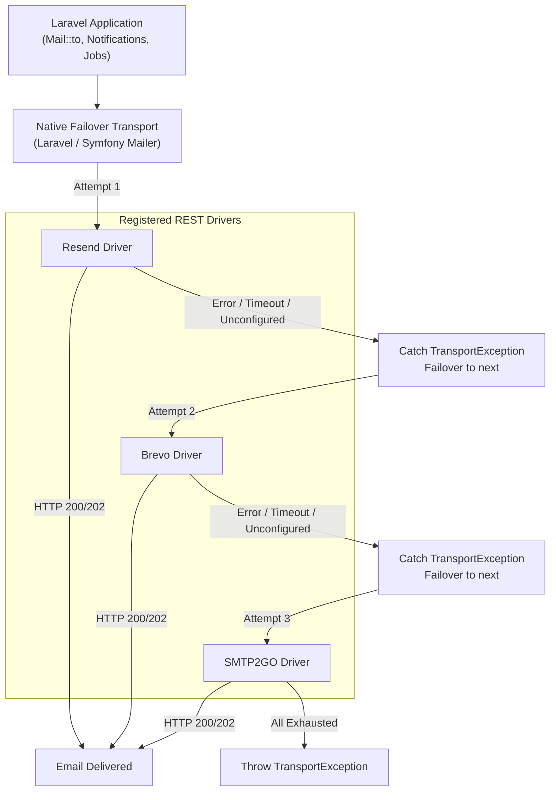

# Laravel Mailer

Zero-SDK REST-based email transport drivers (**Resend**, **Brevo**, and **SMTP2GO**) with zero-configuration native failover for Laravel 12+.

---

## Overview

`eudeka/laravel-mailer` is a drop-in Laravel package that registers lightweight, REST-based mail drivers for popular email providers without requiring vendor SDKs. It integrates directly with Laravel's built-in `failover` mail transport, enabling resilient multi-provider email delivery with zero application code changes.

### Key Highlights

- **Zero-SDK Footprint**: Built purely on Laravel's native `Illuminate\Support\Facades\Http` client—no bulky third-party vendor SDKs or PSR/Guzzle version conflicts.
- **Native Laravel Integration**: 100% standard Laravel mail usage (`Mail::to()->send()`, queues, and notifications). No custom facades, no custom sending methods.
- **Zero-Config Automatic Failover**: Dynamically detects configured API keys in `.env` and automatically registers active providers into Laravel's native `failover` transport.
- **Drop-in for Existing Projects**: Simply install the package, set `MAIL_MAILER=failover` (or choose a specific driver), and configure provider API keys.
- **Payload Normalization**: Automatically transforms recipients, HTML/plain text, attachments, embedded images (`$message->embed()`), and tags/metadata into vendor-compliant REST API formats.

---

## How It Works



---

## Installation

Install the package via Composer:

```bash
composer require eudeka/laravel-mailer
```

---

## Configuration

The package is **zero-config**. You do not need to publish configuration files or edit `config/mail.php`.

### 1. Configure `.env`

Set `MAIL_MAILER` to `failover` (or a specific provider) and supply your API credentials:

```env
# Use native failover across active providers, or specify: 'resend', 'brevo', or 'smtp2go'
MAIL_MAILER=failover

MAIL_FROM_ADDRESS="noreply@example.com"
MAIL_FROM_NAME="${APP_NAME}"

# Provider Credentials (only providers with configured keys are included in failover)
RESEND_API_KEY=re_123456789abcdef
BREVO_API_KEY=xkeysib-123456789abcdef
SMTP2GO_API_KEY=api-123456789abcdef

# (Optional) Customize the failover sequence (default: resend,brevo,smtp2go)
# FAILOVER_MAILERS=resend,brevo
```

### 2. (Optional) Custom Mailer Overrides in `config/mail.php`

If your project requires dedicated mailers with custom endpoints, timeouts, or distinct API keys, define them in `config/mail.php` like any standard Laravel mailer:

```php
'mailers' => [
    'resend-marketing' => [
        'transport' => 'resend',
        'key' => env('RESEND_MARKETING_API_KEY'),
        'timeout' => 15,
    ],
],
```

---

## Usage

Use Laravel's standard mail APIs exactly as you normally would.

### Mailables

```php
use App\Mail\OrderShippedMailable;
use Illuminate\Support\Facades\Mail;

// Synchronous dispatch
Mail::to('customer@example.com')->send(new OrderShippedMailable($order));

// Queued dispatch
Mail::to('customer@example.com')->queue(new OrderShippedMailable($order));
```

### Specific Mailer

Dispatch via a specific provider on demand:

```php
Mail::mailer('resend')->to('customer@example.com')->send(new OrderShippedMailable($order));
```

### Attachments & Embedded Images

Standard attachments and inline images work out of the box:

```php
public function attachments(): array
{
    return [
        Attachment::fromPath(storage_path('invoices/inv-001.pdf'))
            ->as('invoice.pdf')
            ->withMime('application/pdf'),
    ];
}
```

Embedded images in Blade views are automatically Base64-encoded and attached according to each provider's REST schema:

```html
embed(public_path('images/logo.png')) }}" alt="Logo">
```

### Tags & Metadata

Attach tags and metadata using standard Symfony message headers in your Mailables:

```php
use Illuminate\Mail\Mailable;

class OrderConfirmationMailable extends Mailable
{
    public function build(): self
    {
        return $this->subject('Order Confirmation')
            ->html('<p>Thank you for your order!</p>')
            ->withSymfonyMessage(function ($email) {
                // Tags (comma-separated or single)
                $email->getHeaders()->addTextHeader('X-Tag', 'orders, transactional');

                // Metadata (prefixed with X-Metadata-)
                $email->getHeaders()->addTextHeader('X-Metadata-order_id', 'ORD-9842');
                $email->getHeaders()->addTextHeader('X-Metadata-user_id', 'USR-102');
            });
    }
}
```

The payload normalizer translates these headers to match each vendor's API:

| Provider | Tags Mapping | Metadata Mapping |
|---|---|---|
| **Resend** | `tags: [['name' => 'tag', 'value' => 'orders'], ...]` | `tags: [['name' => 'order_id', 'value' => 'ORD-9842'], ...]` |
| **Brevo** | `tags: ['orders', 'transactional']` | `headers: {'X-Metadata-order_id': 'ORD-9842', ...}` |
| **SMTP2GO** | `custom_headers: [{'header': 'X-Tag', 'value': '...'}]` | `custom_headers: [{'header': 'X-Metadata-order_id', ...}]` |

---

## Testing & Local Development

### Daily Development

Use Laravel's built-in `log` driver in local environments:

```env
MAIL_MAILER=log
```

Outbound emails will be logged to `storage/logs/laravel.log`.

---

## Package Development

Commands for maintaining and testing this repository:

```bash
composer test         # Run complete test and analysis pipeline
composer test:unit    # Run Pest test suite
composer test:types   # Verify 100% type coverage
composer analyse      # Run PHPStan / Larastan static analysis
composer lint:check   # Check code style with Laravel Pint
composer lint         # Automatically format code with Laravel Pint
composer build        # Build Orchestra Testbench workbench assets
composer serve        # Start local Testbench workbench server
```

### Codebase Layout

```text
config/
└── mailer.php                       # Default provider configurations
src/
├── Contracts/
│   └── EmailProviderInterface.php   # Provider contract
├── DTO/
│   ├── Address.php                  # Normalized address DTO
│   ├── EmailAttachment.php          # Normalized attachment DTO
│   ├── NormalizedEmailPayload.php   # Normalized email payload DTO
│   └── ProviderResponse.php         # Provider response DTO
├── Normalizer/
│   └── PayloadNormalizer.php        # Symfony Email -> NormalizedEmailPayload
├── Providers/
│   ├── AbstractEmailProvider.php    # Base REST provider
│   ├── BrevoProvider.php            # Brevo REST API driver
│   ├── ResendProvider.php           # Resend REST API driver
│   └── Smtp2goProvider.php          # SMTP2GO REST API driver
├── Transport/
│   └── SingleProviderTransport.php  # Symfony Mailer transport driver
└── LaravelMailerServiceProvider.php # Auto-registration & dynamic failover
```

---

## License

The MIT License (MIT). Please see [LICENSE.md](LICENSE.md) for more information.
