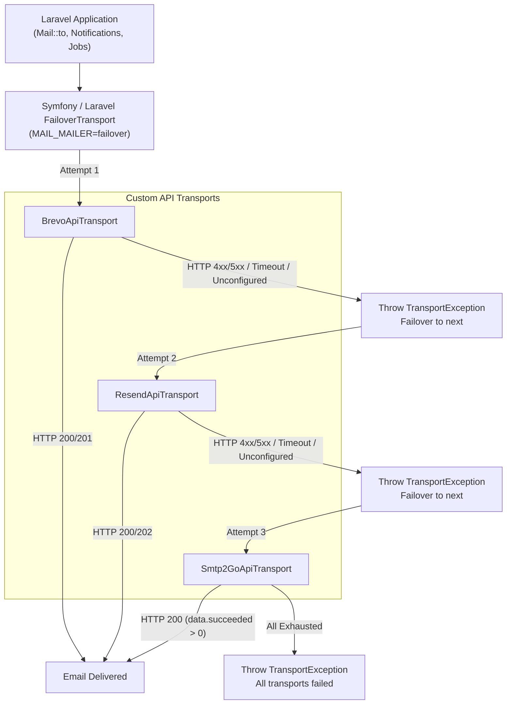

# Laravel Mailer

Zero-SDK REST-based email transport drivers (**Brevo**, **Resend**, and **SMTP2GO**) with plug-and-play native failover for Laravel 12+.

---

## Overview

`eudeka/laravel-mailer` is a drop-in Laravel package that registers lightweight, REST-based mail drivers for popular email providers without requiring vendor SDKs. It integrates directly with Symfony and Laravel's native `failover` mail transport, enabling resilient multi-provider email delivery with safe configuration caching.

### Key Highlights

- **Plug and Play**: Simply install via Composer and set environment variables in `.env`—no configuration publishing required.
- **Zero External SDKs**: Built purely on Laravel's built-in `Illuminate\Support\Facades\Http` client and `symfony/mailer` core components—zero vendor bloat and no PSR/Guzzle version conflicts.
- **Native Failover Integration**: Leverages Symfony's `FailoverTransport` automatically via `Mail::extend()` and dynamic provider resolution.
- **Safe Config Caching**: All `.env` mappings are encapsulated within internal configuration (`config/mailers.php`) to ensure complete compatibility with `php artisan config:cache`.
- **Automated Setup Helper**: Includes `php artisan eudeka:mailer-install` to automatically patch host application `config/mail.php` failover settings and populate `.env` / `.env.example`.

---

## How It Works



---

## Installation

Install the package via Composer:

```bash
composer require eudeka/laravel-mailer
```

### Quick Setup Command

Run the interactive installer to configure your host application's `config/mail.php` failover definition and add sample keys to `.env` and `.env.example`:

```bash
php artisan eudeka:mailer-install
```

---

## Configuration

The package is **zero-config**. Configuration files do not need to be published unless you wish to customize defaults.

### 1. Environment Variables (`.env`)

Set `MAIL_MAILER` to `failover` (or a specific driver) and supply your API keys:

```env
# Default Mailer
MAIL_MAILER=failover

# Sender Identity
MAIL_FROM_ADDRESS="noreply@yourdomain.com"
MAIL_FROM_NAME="${APP_NAME}"

# Failover Provider Sequence (comma-separated, in priority order)
MAIL_FAILOVER_MAILERS=brevo,resend,smtp2go

# Provider API Keys
MAILER_BREVO_API_KEY=xkeysib-123456789abcdef
MAILER_RESEND_API_KEY=re_123456789abcdef
MAILER_SMTP2GO_API_KEY=api-123456789abcdef
```

> [!NOTE]
> For backward compatibility, legacy environment variables (`BREVO_API_KEY`, `RESEND_API_KEY`, `SMTP2GO_API_KEY`, and `FAILOVER_MAILERS`) are also respected as fallbacks.

### 2. (Optional) Custom Driver Configurations

If your project requires dedicated endpoints or custom timeouts, define them in your application's `config/mail.php`:

```php
'mailers' => [
    'resend-marketing' => [
        'transport' => 'resend',
        'key' => env('MAILER_RESEND_API_KEY'),
        'timeout' => 15,
    ],
],
```

---

## Usage

Use Laravel's standard mail APIs exactly as you normally would.

### Standard Mailables

```php
use App\Mail\OrderShippedMailable;
use Illuminate\Support\Facades\Mail;

// Synchronous dispatch
Mail::to('customer@example.com')->send(new OrderShippedMailable($order));

// Queued dispatch
Mail::to('customer@example.com')->queue(new OrderShippedMailable($order));
```

### Specific Mailer

Dispatch via a specific provider on demand:

```php
Mail::mailer('brevo')->to('customer@example.com')->send(new OrderShippedMailable($order));
```

### Attachments & Embedded Images

Standard attachments and inline images work out of the box:

```php
public function attachments(): array
{
    return [
        Attachment::fromPath(storage_path('invoices/inv-001.pdf'))
            ->as('invoice.pdf')
            ->withMime('application/pdf'),
    ];
}
```

Embedded images in Blade views are automatically Base64-encoded and attached according to each provider's REST schema:

```html
embed(public_path('images/logo.png')) }}" alt="Logo">
```

### Tags & Custom Headers

Attach tags and metadata using standard Symfony message headers in your Mailables:

```php
use Illuminate\Mail\Mailable;

class OrderConfirmationMailable extends Mailable
{
    public function build(): self
    {
        return $this->subject('Order Confirmation')
            ->html('<p>Thank you for your order!</p>')
            ->withSymfonyMessage(function ($email) {
                // Tags
                $email->getHeaders()->addTextHeader('X-Tag', 'orders, transactional');

                // Custom Headers
                $email->getHeaders()->addTextHeader('X-Entity-ID', '12345');
            });
    }
}
```

---

## Testing & Verification

Run the package test suite:

```bash
composer test         # Run complete test and analysis pipeline
composer test:unit    # Run Pest test suite
composer test:types   # Verify 100% type coverage
composer analyse      # Run PHPStan static analysis
composer lint:check   # Check code style with Laravel Pint
composer lint         # Automatically format code with Laravel Pint
```

### Codebase Layout

```text
config/
└── mailers.php                            # Package internal configuration
src/
├── Commands/
│   └── MailerInstallCommand.php           # Artisan setup command (eudeka:mailer-install)
├── Transport/
│   ├── Concerns/
│   │   └── ExtractsEmailData.php          # Shared MIME, address & attachment normalization trait
│   ├── BrevoApiTransport.php              # Standalone Brevo REST transport
│   ├── ResendApiTransport.php             # Standalone Resend REST transport
│   └── Smtp2GoApiTransport.php            # Standalone SMTP2GO REST transport
└── LaravelMailerServiceProvider.php       # Provider registration and dynamic failover setup
```

---

## License

The MIT License (MIT). Please see [LICENSE.md](LICENSE.md) for more information.
