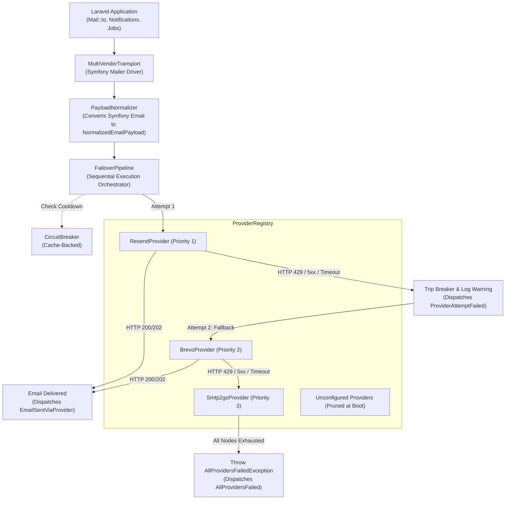
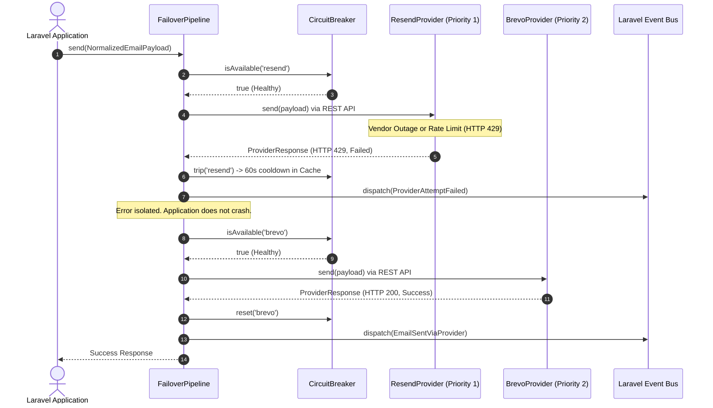

# Laravel Multi-Vendor Email Provider

Zero-SDK REST-based email transport with dynamic runtime pruning, sequential failover, and cache-backed circuit breaker for Laravel 13+.

---

## Architecture & Core Concepts

### 1. Zero-SDK Multi-Vendor Abstraction Layer
Provides a unified REST-based transport wrapper for Laravel 13+, abstracting multiple third-party email APIs (**Resend**, **Brevo**, and **SMTP2GO**) into a single internal dependency without vendor SDK bloat.
- Built on Laravel's native `Illuminate\Support\Facades\Http` client.
- No third-party vendor SDK dependencies—prevents Guzzle/PSR version conflicts.
- Plugs into Symfony Mailer via [`MultiVendorTransport`](src/Transport/MultiVendorTransport.php), keeping standard `Mail::to()` and `Notification` workflows unchanged.

### 2. Dynamic Execution Graph & Runtime Pruning
Parses global priority configurations during application boot. Any provider node missing valid API credentials is automatically pruned from the execution sequence, preventing redundant runtime checks and unnecessary network hops.
- Managed by [`ProviderRegistry`](src/Pipeline/ProviderRegistry.php).
- Evaluates `hasCredentials()` on registered providers.
- Omitted or empty API keys in `.env` are filtered out before sending, preventing failed outbound HTTP calls.

### 3. Payload Normalization Engine
Transforms standard outbound email payloads—including primary, carbon copy, and blind carbon copy recipient arrays, multipart text/HTML content, and Base64-encoded binary attachments—into vendor-compliant REST API JSON structures at the transport boundary.
- Executed by [`PayloadNormalizer`](src/Normalizer/PayloadNormalizer.php), converting Symfony `Email` instances into [`NormalizedEmailPayload`](src/DTO/NormalizedEmailPayload.php).
- Normalizes sender, `To`, `Cc`, `Bcc`, and `Reply-To` addresses with optional display names.
- Translates binary file attachments and inline embedded images (`$message->embed()`) into Base64 payloads matching each vendor's API schema.

### 4. Fault Isolation & Sequential Failover
Wraps initialized HTTP transports in a sequential fallback pipeline. Intercepts non-2xx HTTP responses (such as rate limits, quota exhaustion, authentication errors, and remote server failures) and immediately reroutes the normalized payload to the next available provider.
- Managed by [`FailoverPipeline`](src/Pipeline/FailoverPipeline.php).
- Evaluates the priority chain sequentially (e.g., `resend` &rarr; `brevo` &rarr; `smtp2go`).
- If an active provider fails or times out, the pipeline catches the error, logs a warning, dispatches an event, and passes the payload to the next provider in line.

### 5. System Resilience & Exception Handling
Suppresses intermediate HTTP failures and transport exceptions within the fallback loop. Prevents host application process crashes and only bubbles a fatal runtime exception if all configured provider nodes in the active stack fail sequentially.
- **Cache-Backed Circuit Breaker** ([`CircuitBreaker`](src/Resilience/CircuitBreaker.php)): Trips on HTTP 429 (Rate Limit), HTTP 5xx (Server Error), or connection failure (status 0). Puts failing providers into a temporary cooldown (default: 60s) so subsequent requests bypass them immediately.
- **Intermediate Exception Suppression**: Individual provider failures will not crash queue workers or request lifecycles.
- **Fail-Safe Final Boundary**: Throws [`AllProvidersFailedException`](src/Exceptions/AllProvidersFailedException.php) only when all active providers in the priority chain fail.

---

## Architecture & Failover Flow

### Component Data Flow



### Sequential Failover Sequence



---

## Quick Start

### 1. Install via Composer

```bash
composer require eudeka/email-provider
```

### 2. Publish Configuration

```bash
php artisan vendor:publish --tag="email-provider-config"
```

Generates `config/email-provider.php`.

### 3. Register Mailer Driver

In `config/mail.php`, register the `multi-vendor` driver:

```php
'mailers' => [
    // ...
    'multi-vendor' => [
        'transport' => 'multi-vendor',
    ],
],
```

### 4. Configure `.env`

Set the mail driver and add your API credentials:

```env
MAIL_MAILER=multi-vendor
MAIL_FROM_ADDRESS="noreply@example.com"
MAIL_FROM_NAME="${APP_NAME}"

# Provider Credentials (unconfigured keys are pruned automatically)
RESEND_API_KEY=re_123456789abcdef
BREVO_API_KEY=xkeysib-123456789abcdef
SMTP2GO_API_KEY=api-123456789abcdef
```

### 5. Check Setup

```bash
php artisan email-provider:status
```

---

## Local Development & Safe Testing

> [!IMPORTANT]
> Do not use production API keys during local development or database seeding to prevent quota consumption and accidental customer emails.

### Daily Development
Use the built-in `log` driver or Mailpit in your local `.env`:

```env
MAIL_MAILER=log
```

Outbound emails are recorded in `storage/logs/laravel.log`.

### Verifying Provider Integration
To test the failover pipeline without modifying application code:

```bash
php artisan email-provider:test your.email@example.com --subject="Integration Test"
```

---

## Usage

Standard Laravel mail APIs work directly with no code modifications.

### Mailables

```php
use App\Mail\InvoiceMailable;
use Illuminate\Support\Facades\Mail;

// Synchronous send
Mail::to('client@example.com')->send(new InvoiceMailable($invoice));

// Queued send
Mail::to('client@example.com')->queue(new InvoiceMailable($invoice));
```

### CC, BCC & Attachments

```php
Mail::to('client@example.com')
    ->cc('manager@example.com')
    ->bcc('audit@example.com')
    ->send(new InvoiceMailable($invoice));
```

In your Mailable class:

```php
public function attachments(): array
{
    return [
        Attachment::fromPath(storage_path('invoices/inv-001.pdf'))
            ->as('invoice.pdf')
            ->withMime('application/pdf'),
    ];
}
```

Inline embedded images inside Blade templates are normalized automatically:

```html
embed(public_path('images/logo.png')) }}" alt="Logo">
```

### Notifications

```php
$user->notify(new OrderShippedNotification($order));
```

---

## CLI Diagnostics

### Status Command

Inspect priority sequence, credential availability, and circuit breaker states:

```bash
php artisan email-provider:status
```

Example output:

```text
+----------+----------+--------------------+------------------------+-----------------+
| Priority | Provider | Credentials        | Circuit Breaker        | Effective State |
+----------+----------+--------------------+------------------------+-----------------+
| 1        | resend   | Configured         | Healthy                | Active          |
| 2        | brevo    | Missing (Pruned)   | Healthy                | Pruned          |
| 3        | smtp2go  | Configured         | Cooldown (42s remain)  | Degraded        |
+----------+----------+--------------------+------------------------+-----------------+
```

| State | Description |
|---|---|
| `Active` | Ready to dispatch emails. Valid credentials and healthy breaker. |
| `Pruned` | No API key in `.env`. Excluded from the execution sequence at boot. |
| `Degraded` | In cooldown due to recent 429/5xx error. Temporarily bypassed. |

### Test Command

Send an ad-hoc email through the active pipeline:

```bash
php artisan email-provider:test recipient@example.com \
    --from="sender@example.com" \
    --from-name="System Test" \
    --subject="Deliverability Check" \
    --body="Testing multi-vendor mailer integration."
```

---

## Configuration Reference

Default settings in `config/email-provider.php`:

| Key | Default | Description |
|---|---|---|
| `RESEND_API_KEY` | `null` | Resend API key. Omit to prune Resend. |
| `RESEND_ENDPOINT` | `https://api.resend.com/emails` | Resend REST API URL. |
| `RESEND_TIMEOUT` | `10` | Request timeout in seconds. |
| `BREVO_API_KEY` | `null` | Brevo API key. Omit to prune Brevo. |
| `BREVO_ENDPOINT` | `https://api.brevo.com/v3/smtp/email` | Brevo REST API URL. |
| `BREVO_TIMEOUT` | `10` | Request timeout in seconds. |
| `SMTP2GO_API_KEY` | `null` | SMTP2GO API key. Omit to prune SMTP2GO. |
| `SMTP2GO_ENDPOINT` | `https://api.smtp2go.com/v3/email/send` | SMTP2GO REST API URL. |
| `SMTP2GO_TIMEOUT` | `10` | Request timeout in seconds. |
| `EMAIL_PROVIDER_CIRCUIT_BREAKER_ENABLED` | `true` | Enable/disable circuit breaker. |
| `EMAIL_PROVIDER_COOLDOWN_SECONDS` | `60` | Cooldown period following a 429/5xx error. |
| `EMAIL_PROVIDER_CACHE_STORE` | `null` | Cache store for breaker states (`null` uses default cache). |
| `EMAIL_PROVIDER_CACHE_PREFIX` | `email_provider_breaker:` | Cache key prefix for breaker status. |

---

## Events & Observability

Listen to pipeline lifecycle events in your `EventServiceProvider` or listeners:

| Event | Dispatched When |
|---|---|
| [`EmailSentViaProvider`](src/Events/EmailSentViaProvider.php) | Email was accepted by a provider REST API (`$providerName`, `$response`, `$payload`, `$attempts`). |
| [`ProviderAttemptFailed`](src/Events/ProviderAttemptFailed.php) | An active provider failed (`$providerName`, `$response`, `$payload`, `$trippedCircuitBreaker`). |
| [`AllProvidersFailed`](src/Events/AllProvidersFailed.php) | All providers in the execution sequence failed (`$payload`, `$failures`). |

---

## Extending with Custom Providers

Implement [`EmailProviderInterface`](src/Contracts/EmailProviderInterface.php) and register via the `EmailProvider` facade:

```php
namespace App\Services\Email;

use EmailProvider\EmailProvider\Contracts\EmailProviderInterface;
use EmailProvider\EmailProvider\DTO\NormalizedEmailPayload;
use EmailProvider\EmailProvider\DTO\ProviderResponse;
use Illuminate\Support\Facades\Http;

class PostmarkProvider implements EmailProviderInterface
{
    public function name(): string
    {
        return 'postmark';
    }

    public function hasCredentials(): bool
    {
        return ! empty(config('services.postmark.token'));
    }

    public function send(NormalizedEmailPayload $payload): ProviderResponse
    {
        $response = Http::withHeaders([
            'X-Postmark-Server-Token' => config('services.postmark.token'),
            'Accept' => 'application/json',
        ])->post('https://api.postmarkapp.com/email', [
            'From' => $payload->from->fullAddress(),
            'To' => implode(', ', array_map(fn ($to) => $to->fullAddress(), $payload->to)),
            'Subject' => $payload->subject,
            'HtmlBody' => $payload->html,
            'TextBody' => $payload->text,
        ]);

        if ($response->successful()) {
            return ProviderResponse::success(
                providerName: $this->name(),
                statusCode: $response->status(),
                messageId: (string) $response->json('MessageID'),
            );
        }

        return ProviderResponse::failure(
            providerName: $this->name(),
            statusCode: $response->status(),
            errorMessage: (string) $response->json('Message', 'Postmark error'),
        );
    }
}
```

Register in `AppServiceProvider::boot()`:

```php
use App\Services\Email\PostmarkProvider;
use EmailProvider\EmailProvider\Facades\EmailProvider;

EmailProvider::extend('postmark', fn () => new PostmarkProvider());
```

Add `'postmark'` to `'priority'` in `config/email-provider.php`.

---

## Package Development & Maintenance

Commands for maintaining and extending this repository:

```bash
composer test         # Run complete test and analysis pipeline
composer test:unit    # Run Pest test suite
composer test:types   # Verify 100% type coverage
composer analyse      # Run PHPStan / Larastan static analysis
composer lint:check   # Check code style with Laravel Pint
composer lint         # Automatically format code with Laravel Pint
composer build        # Build Orchestra Testbench workbench assets
composer serve        # Start local Testbench workbench server
```

### Codebase Layout

```text
src/
├── Console/Commands/   # StatusCommand and TestCommand
├── Contracts/          # EmailProviderInterface
├── DTO/                # NormalizedEmailPayload, ProviderResponse, Address, EmailAttachment
├── Events/             # EmailSentViaProvider, ProviderAttemptFailed, AllProvidersFailed
├── Exceptions/         # AllProvidersFailedException, NoActiveProvidersException
├── Facades/            # EmailProvider facade
├── Normalizer/         # PayloadNormalizer (Symfony Email -> NormalizedEmailPayload)
├── Pipeline/           # FailoverPipeline and ProviderRegistry
├── Providers/          # ResendProvider, BrevoProvider, Smtp2goProvider, AbstractEmailProvider
├── Resilience/         # CircuitBreaker (cache-backed cooldown)
└── Transport/          # MultiVendorTransport (Symfony Mailer transport driver)
```
