# Laravel 13 Mail Transport Architecture & Extension Guide

This document defines the architectural standards, design principles, and implementation workflow for adding and maintaining email transport drivers in `eudeka/laravel-mailer`.

Whether you are a new software engineer or an AI coding agent, follow this guide strictly to maintain consistency, reliability, and full compatibility across all providers and Laravel 13+ conventions.

---

## Table of Contents

1. [Architecture Overview & High-Level Flow](#1-architecture-overview--high-level-flow)
2. [The 8 Core Architectural Invariants](#2-the-8-core-architectural-invariants)
    - [Invariant 1: Zero-SDK & Native HTTP Client](#invariant-1-zero-sdk--native-http-client)
    - [Invariant 2: Strict Instant Failover Policy (Zero-Retry)](#invariant-2-strict-instant-failover-policy-zero-retry)
    - [Invariant 3: Normalized Email Extraction](#invariant-3-normalized-email-extraction)
    - [Invariant 4: Deterministic Idempotency Key Injection](#invariant-4-deterministic-idempotency-key-injection)
    - [Invariant 5: Strict 2xx Response Validation & Silent Failure Detection](#invariant-5-strict-2xx-response-validation--silent-failure-detection)
    - [Invariant 6: Attachment & Inline CID Normalization](#invariant-6-attachment--inline-cid-normalization)
    - [Invariant 7: Rate Limit Enrichment (HTTP 429 & Retry-After)](#invariant-7-rate-limit-enrichment-http-429--retry-after)
    - [Invariant 8: Metadata, Tags, & Custom Header Mapping](#invariant-8-metadata-tags--custom-header-mapping)
3. [The 10-Step New Provider Implementation Workflow](#3-the-10-step-new-provider-implementation-workflow)
4. [Reference Boilerplate: `AcmeApiTransport`](#4-reference-boilerplate-acmeapitransport)
5. [Wiring into Service Provider, Config, & Installer](#5-wiring-into-service-provider-config--installer)
6. [Provider Edge Cases & Constraints Matrix](#6-provider-edge-cases--constraints-matrix)
7. [Pest Testing Specification & Recipes](#7-pest-testing-specification--recipes)

---

## 1. Architecture Overview & High-Level Flow

In Laravel 13, email dispatch integrates directly with Symfony Mailer (`symfony/mailer`). When a Mailable or Notification is dispatched:

1. Laravel compiles the message into a `Symfony\Component\Mime\Email` object wrapped in a `Symfony\Component\Mailer\SentMessage`.
2. If multi-vendor failover is configured (`MAIL_MAILER=failover`), Symfony's `FailoverTransport` dispatches the message to the first available transport.
3. If an attempt encounters a network failure, timeout, invalid API response, or HTTP 4xx/5xx status, the transport **MUST throw** a `Symfony\Component\Mailer\Exception\TransportException`.
4. `FailoverTransport` catches `TransportExceptionInterface` and immediately delegates the delivery to the subsequent configured provider.

```mermaid
flowchart TD
    App["Laravel Application<br/>(Mailable / Notification / Mail Facade)"] --> Failover["Symfony FailoverTransport<br/>(MAIL_MAILER=failover)"]

    subgraph Drivers["Registered Custom API Transports"]
        T1["Primary: BrevoApiTransport"]
        T2["Secondary: ResendApiTransport"]
        T3["Tertiary: Smtp2GoApiTransport"]
        TN["New: [Provider]ApiTransport"]
    end

    Failover -->|Attempt 1| T1
    T1 -->|HTTP 200/201 (Valid messageId)| Success["Email Delivered Successfully"]
    T1 -->|HTTP 4xx/5xx / Timeout / Auth Error| E1["Throw TransportException"]
    E1 -->|Failover Handover| T2

    T2 -->|HTTP 200/202 (Valid messageId)| Success
    T2 -->|HTTP 4xx/5xx / Timeout / Auth Error| E2["Throw TransportException"]
    E2 -->|Failover Handover| T3

    T3 -->|"HTTP 200 (succeeded > 0)"| Success
    T3 -->|HTTP 4xx/5xx / Timeout / Auth Error| E3["Throw TransportException"]
    E3 -->|Failover Handover| TN

    TN -->|Exhausted All Providers| FinalError["Throw TransportException<br/>All transports failed to send message"]
```

---

## 2. The 8 Core Architectural Invariants

Every custom transport class in this package must adhere to these 8 foundational rules:

### Invariant 1: Zero-SDK & Native HTTP Client

- **Rule**: Never install vendor SDK packages (e.g., `resend/resend-php`, `brevo/brevo-php`, `mailgun/mailgun-php`).
- **Rationale**: External SDKs introduce dependency conflicts, version pinning issues with Guzzle/PSR-7, and bloat the application vendor footprint.
- **Implementation**: Rely exclusively on Laravel's built-in `Illuminate\Support\Facades\Http` client.
- **Headers**: Always specify:
    - `'Content-Type' => 'application/json'`
    - `'Accept' => 'application/json'`
    - `'User-Agent' => 'eudeka-laravel-mailer/1.0'` (prevents Cloudflare and WAF rejections like Resend Error 1010).

### Invariant 2: Strict Instant Failover Policy (Zero-Retry)

- **Rule**: **NEVER** call `Http::retry()` inside the transport layer.
- **Rationale**: Retrying within an individual transport causes queue worker timeouts and delays failover. When an API is rate-limited (HTTP 429), experiencing an outage (HTTP 5xx), or timing out, the message must transition immediately to the next healthy provider in the failover chain.
- **Error Propagation**: Any cURL timeout, connection failure, or HTTP error status must immediately throw a `Symfony\Component\Mailer\Exception\TransportException`.
- **Queue Retries**: Retries are handled cleanly at the Laravel queue job level, backed by deterministic idempotency keys.

### Invariant 3: Normalized Email Extraction

- **Rule**: All email parsing must utilize the shared [`Eudeka\LaravelMailer\Transport\Concerns\ExtractsEmailData`](../src/Transport/Concerns/ExtractsEmailData.php) trait.
- **Key trait helpers**:
    - `extractEmail(SentMessage $message): Email`: Normalizes raw messages and converts to a standard Symfony `Email` instance.
    - `formatAddress(Address $address): string`: Converts Symfony `Address` into RFC-5322 string (`Name <email>` or `email`).
    - `addressToArray(Address $address, ?int $maxNameLength = null): array`: Converts Symfony `Address` into `['email' => ..., 'name' => ...]`, with optional string truncation for providers with length limits (e.g., Brevo's 70-character limit).
    - `resolvePlainTextBody(mixed $text, mixed $html): ?string`: Automatically strips HTML tags to produce a clean plain-text fallback when no explicit plain-text body is supplied.

### Invariant 4: Deterministic Idempotency Key Injection

- **Rule**: Every outgoing API request must include an idempotency key to prevent double delivery on queue retries.
- **Priority resolution**:
    1. Explicit developer header: `Idempotency-Key` or `X-Idempotency-Key`.
    2. The email's `Message-ID` header.
    3. Deterministic SHA-256 fingerprint: `hash('sha256', "{$from}|{$to}|{$subject}|{$timestamp}")`.
- **Sanitization**: Sanitize the key to ASCII characters (`0x20-0x7E`) and truncate to 256 characters using `sanitizeIdempotencyKey()`.

### Invariant 5: Strict 2xx Response Validation & Silent Failure Detection

- **Rule**: Do not assume an HTTP 200/201/202 status guarantees delivery acceptance.
- **Provider anomalies**:
    - Some APIs return `HTTP 200 OK` with a JSON payload indicating failure (e.g., SMTP2GO returns HTTP 200 with `data.failed > 0`).
    - Some APIs return `HTTP 200` with an empty message ID or error envelopes (e.g., `{"data": null, "error": {...}}`).
- **Validation**: Verify that a non-empty string `messageId` exists in the response.
- **Post-dispatch assignment**:
    ```php
    $message->setMessageId($messageId);
    $message->appendDebug('Sent via [Provider] API');
    ```

### Invariant 6: Attachment & Inline CID Normalization

- **Rule**: Distinctly handle physical attachments (`disposition: attachment`) versus embedded inline images (`disposition: inline`, `contentId`).
- **Provider strategies**:
    - **Inline Data URI conversion** (e.g., Brevo): Inline images are converted into Base64 Data URIs (`data:{mime};base64,{data}`) and replaced in the HTML body (`cid:...`), while standard attachments remain in the attachment array.
    - **Dedicated inline array** (e.g., SMTP2GO): File attachments are placed in `attachments`, and CID images are placed in `inlines`.
    - **Single array with `content_id`** (e.g., Resend): Both are placed in `attachments`, with `content_id` specified for inline parts.

### Invariant 7: Rate Limit Enrichment (HTTP 429 & Retry-After)

- **Rule**: When receiving an HTTP 429 response, inspect the `Retry-After` header.
- **Exception message**: Enrich the `TransportException` message using:
    ```php
    $errorMsg = $this->formatRetryAfterError($errorMsg, $response->header('Retry-After'), $response->status());
    ```
- This ensures application logs and queue backoff monitors provide actionable timing information.

### Invariant 8: Metadata, Tags, & Custom Header Mapping

- **Rule**: Preserve custom tracking metadata and tags set via Laravel Mailables or Symfony headers.
- Filter reserved MIME headers (`from`, `to`, `subject`, `date`, `content-type`, etc.) using `extractHeadersTagsAndMetadata()`.
- Map tags and metadata to the target provider's native schema (e.g., `tags` array, `params` dictionary, or `X-Metadata-*` custom headers).

---

## 3. The 10-Step New Provider Implementation Workflow

Follow these 10 steps sequentially whenever adding a new email provider:

```mermaid
graph LR
    S1[1. Research API Docs] --> S2[2. Identify Quirks]
    S2 --> S3[3. Create Transport Class]
    S3 --> S4[4. Add Config Mapping]
    S4 --> S5[5. Register in ServiceProvider]
    S5 --> S6[6. Update Failover Defaults]
    S6 --> S7[7. Update MailerInstallCommand]
    S7 --> S8[8. Write Pest Tests]
    S8 --> S9[9. Update Documentation]
    S9 --> S10[10. Run Full QA Suite]
```



1. **Step 1: Research Official REST API Specifications**
    - Check endpoint URL, HTTP method (`POST`), authentication header (`Bearer`, `api-key`, etc.).
    - Check request schema: recipient formats, attachment encodings, metadata/tag structure.
    - Check response schema: success status codes (200, 201, 202) and location of the `message_id`.

2. **Step 2: Identify Provider-Specific Constraints & Quirks**
    - Max attachment size (e.g., 10MB, 25MB, 50MB).
    - Display name length limits (e.g., Brevo 70 chars).
    - How inline CID images are received (Base64 data URI vs separate field).
    - Error envelope quirks (e.g., 200 OK with error body).

3. **Step 3: Implement `[Provider]ApiTransport` in `src/Transport/`**
    - Extend `Symfony\Component\Mailer\Transport\AbstractTransport`.
    - Use `ExtractsEmailData` trait.
    - Implement `__construct()`, `apiKey()`, `endpoint()`, `timeout()`, `doSend()`, and `__toString()`.

4. **Step 4: Register Internal Configuration in `config/mailers.php`**
    - Define provider key with standard environment variable fallbacks:
        ```php
        'acme' => [
            'transport' => 'acme',
            'key' => env('MAILER_ACME_API_KEY', env('ACME_API_KEY')),
            'endpoint' => env('MAILER_ACME_ENDPOINT', env('ACME_ENDPOINT', 'https://api.acme.com/v1/send')),
            'timeout' => (int) env('MAILER_ACME_TIMEOUT', env('ACME_TIMEOUT', 10)),
        ],
        ```

5. **Step 5: Register in `LaravelMailerServiceProvider`**
    - Add `$mailManager->extend('acme', fn (array $config = []) => $this->createAcmeTransport($config));`
    - Implement `private function createAcmeTransport(array $config = []): AcmeApiTransport`.

6. **Step 6: Update Failover Priority & Resolution**
    - Add the new provider to default `$priorityList` inside `configureFailoverMailer()` if appropriate.

7. **Step 7: Update Setup Command & Environment Stubs**
    - Update [`MailerInstallCommand.php`](../src/Commands/MailerInstallCommand.php) to prompt for or populate `MAILER_ACME_API_KEY` in `.env` and `.env.example`.

8. **Step 8: Write Comprehensive Pest Unit & Integration Tests**
    - Unit tests covering: successful delivery, missing API key, invalid payload, rate limiting (429), server errors (500), silent failures in 2xx responses, and timeout.
    - Failover tests verifying handover to the next driver.

9. **Step 9: Author Provider Documentation & Update Package Metadata**
    - Author a dedicated provider specification in `docs/providers/[provider].md` strictly following the standard blueprint in [`providers/README.md`](providers/README.md). See examples: [`providers/brevo.md`](providers/brevo.md), [`providers/resend.md`](providers/resend.md), [`providers/smtp2go.md`](providers/smtp2go.md).
    - Update `README.md` and Boost skills with new provider environment variables and capabilities.

10. **Step 10: Run Quality Assurance Validation**
    - Execute `composer lint:check` (Pint).
    - Execute `composer analyse` (PHPStan/Larastan at 100% type coverage).
    - Execute `composer test` (Pest unit and arch tests).

---

## 4. Reference Boilerplate: `AcmeApiTransport`

Below is the standard, production-ready implementation template for a new mail transport:

```php
<?php

declare(strict_types=1);

namespace Eudeka\LaravelMailer\Transport;

use Eudeka\LaravelMailer\Transport\Concerns\ExtractsEmailData;
use Illuminate\Support\Facades\Http;
use Psr\EventDispatcher\EventDispatcherInterface;
use Psr\Log\LoggerInterface;
use Symfony\Component\Mailer\Exception\TransportException;
use Symfony\Component\Mailer\SentMessage;
use Symfony\Component\Mailer\Transport\AbstractTransport;
use Symfony\Component\Mime\Address;
use Throwable;

final class AcmeApiTransport extends AbstractTransport
{
    use ExtractsEmailData;

    public function __construct(
        private readonly ?string $apiKey = null,
        private readonly string $endpoint = 'https://api.acme.com/v1/emails',
        private readonly int $timeout = 10,
        ?EventDispatcherInterface $dispatcher = null,
        ?LoggerInterface $logger = null,
    ) {
        parent::__construct($dispatcher, $logger);
    }

    public function apiKey(): ?string
    {
        return $this->apiKey;
    }

    public function endpoint(): string
    {
        return $this->endpoint;
    }

    public function timeout(): int
    {
        return $this->timeout;
    }

    protected function doSend(SentMessage $message): void
    {
        // 1. Guard: Enforce API Key presence
        if ($this->apiKey === null || trim($this->apiKey) === '') {
            throw new TransportException('Acme API key is missing or not configured.');
        }

        // 2. Extract Symfony Email object
        $email = $this->extractEmail($message);

        // 3. Sender resolution
        $fromAddresses = $email->getFrom();
        $sender = isset($fromAddresses[0])
            ? $this->formatAddress($fromAddresses[0])
            : 'noreply@example.com';

        // 4. Recipient resolution (enforce at least one 'To' recipient)
        $to = array_map(fn (Address $addr): string => $this->formatAddress($addr), $email->getTo());

        if ($to === []) {
            throw new TransportException('Acme requires at least one "to" recipient.');
        }

        // 5. Build base payload
        /** @var array<string, mixed> $payload */
        $payload = [
            'from' => $sender,
            'to' => $to,
            'subject' => (string) ($email->getSubject() ?? '(No Subject)'),
        ];

        // 6. Handle Attachments & Inlines
        $rawAttachments = $this->extractAttachments($email);
        $html = $email->getHtmlBody();

        if (is_string($html) && $html !== '') {
            $payload['html'] = $html;
        }

        // Fallback plain-text extraction
        $text = $this->resolvePlainTextBody($email->getTextBody(), $html);
        if (is_string($text) && $text !== '') {
            $payload['text'] = $text;
        }

        // 7. Optional Recipient Fields (CC, BCC, Reply-To)
        $cc = array_map(fn (Address $addr): string => $this->formatAddress($addr), $email->getCc());
        if ($cc !== []) {
            $payload['cc'] = $cc;
        }

        $bcc = array_map(fn (Address $addr): string => $this->formatAddress($addr), $email->getBcc());
        if ($bcc !== []) {
            $payload['bcc'] = $bcc;
        }

        $replyTo = $email->getReplyTo();
        if (isset($replyTo[0])) {
            $payload['reply_to'] = $this->formatAddress($replyTo[0]);
        }

        // Attachments payload structure
        if ($rawAttachments !== []) {
            $payload['attachments'] = array_map(
                fn (array $att): array => [
                    'filename' => $att['filename'],
                    'content' => $att['content'], // Base64 encoded
                    'content_type' => $att['contentType'],
                ],
                $rawAttachments,
            );
        }

        // 8. Headers, Tags, and Metadata
        $extracted = $this->extractHeadersTagsAndMetadata($email);
        $headers = $extracted['headers'];
        $metadata = $extracted['metadata'];
        $tags = $extracted['tags'];

        if ($metadata !== []) {
            $payload['metadata'] = $metadata;
        }

        if ($tags !== []) {
            $payload['tags'] = $tags;
        }

        // 9. Deterministic Idempotency Key
        $senderEmail = isset($fromAddresses[0]) ? $fromAddresses[0]->getAddress() : 'noreply@example.com';
        $toEmails = array_map(fn (Address $addr): string => $addr->getAddress(), $email->getTo());
        $idempotencyKey = $this->resolveIdempotencyKey($headers, $email, $senderEmail, $toEmails);
        $headers = $this->removeHeaderCaseInsensitive($headers, ['idempotency-key', 'x-idempotency-key']);

        if ($headers !== []) {
            $payload['headers'] = $headers;
        }

        // 10. HTTP Dispatch (Single Attempt - Instant Failover)
        try {
            $response = Http::withHeaders([
                'Authorization' => 'Bearer '.$this->apiKey,
                'Idempotency-Key' => $idempotencyKey,
                'Content-Type' => 'application/json',
                'Accept' => 'application/json',
                'User-Agent' => 'eudeka-laravel-mailer/1.0',
            ])
                ->timeout($this->timeout)
                ->post($this->endpoint, $payload);
        } catch (Throwable $e) {
            throw new TransportException(sprintf('Failed sending email via Acme: %s', $e->getMessage()), 0, $e);
        }

        // 11. Validate Non-2xx Responses & Enrich HTTP 429
        if (! $response->successful()) {
            $rawMsg = $response->json('message') ?? $response->body();
            $msgText = is_string($rawMsg) ? $rawMsg : (json_encode($rawMsg) ?: 'Unknown error');

            $errorMsg = $this->formatRetryAfterError(
                $msgText,
                $response->header('Retry-After'),
                $response->status(),
            );

            throw new TransportException(sprintf(
                'Failed sending email via Acme (HTTP %d): %s',
                $response->status(),
                $errorMsg,
            ));
        }

        // 12. Guard against Silent Failures within 2xx responses
        $code = $response->json('code');
        $error = $response->json('error');
        if (is_string($code) && $code !== '') {
            throw new TransportException(sprintf('Failed sending email via Acme: code: %s', $code));
        }
        if ($error !== null && $error !== false && $error !== '') {
            throw new TransportException(sprintf('Failed sending email via Acme: %s', is_string($error) ? $error : json_encode($error)));
        }

        // 13. Extract Accepted Message ID
        $messageId = $response->json('id') ?? $response->json('message_id');
        if (! is_string($messageId) || trim($messageId) === '') {
            throw new TransportException('Failed sending email via Acme: Provider returned 2xx response but did not return a valid messageId.');
        }

        // 14. Finalize SentMessage
        $message->setMessageId($messageId);
        $message->appendDebug('Sent via Acme API');
    }

    public function __toString(): string
    {
        return 'acme';
    }
}
```

---

## 5. Wiring into Service Provider, Config, & Installer

When adding a new driver, register it cleanly into Laravel's container and configuration:

### 1. Update `config/mailers.php`

Add the configuration block with fallback variables:

```php
'acme' => [
    'transport' => 'acme',
    'key' => env('MAILER_ACME_API_KEY', env('ACME_API_KEY')),
    'endpoint' => env('MAILER_ACME_ENDPOINT', env('ACME_ENDPOINT', 'https://api.acme.com/v1/emails')),
    'timeout' => (int) env('MAILER_ACME_TIMEOUT', env('ACME_TIMEOUT', 10)),
],
```

### 2. Register Driver in `LaravelMailerServiceProvider.php`

In `registerMailDrivers()`:

```php
$mailManager->extend('acme', function (array $config = []): AcmeApiTransport {
    /** @var array<string, mixed> $typedConfig */
    $typedConfig = $config;

    return $this->createAcmeTransport($typedConfig);
});
```

Implement the factory method:

```php
/**
 * Resolve an AcmeApiTransport instance.
 *
 * @param array<string, mixed> $config
 */
private function createAcmeTransport(array $config = []): AcmeApiTransport
{
    /** @var Repository $configRepo */
    $configRepo = $this->app->make(Repository::class);

    $apiKey = isset($config['key']) && is_string($config['key'])
        ? $config['key']
        : (isset($config['api_key']) && is_string($config['api_key'])
            ? $config['api_key']
            : (is_string($configRepo->get('mail.mailers.acme.key'))
                ? (string) $configRepo->get('mail.mailers.acme.key')
                : (is_string($configRepo->get('mail.mailers.acme.api_key'))
                    ? (string) $configRepo->get('mail.mailers.acme.api_key')
                    : null)));

    $endpoint = isset($config['endpoint']) && is_string($config['endpoint']) && $config['endpoint'] !== ''
        ? $config['endpoint']
        : (is_string($configRepo->get('mail.mailers.acme.endpoint'))
            ? (string) $configRepo->get('mail.mailers.acme.endpoint')
            : 'https://api.acme.com/v1/emails');

    $timeout = isset($config['timeout']) && is_numeric($config['timeout'])
        ? (int) $config['timeout']
        : (is_numeric($configRepo->get('mail.mailers.acme.timeout'))
            ? (int) $configRepo->get('mail.mailers.acme.timeout')
            : 10);

    return new AcmeApiTransport(
        apiKey: $apiKey !== '' ? $apiKey : null,
        endpoint: $endpoint,
        timeout: $timeout,
    );
}
```

### 3. Update Installer Command (`MailerInstallCommand.php`)

Ensure the new environment variables (`MAILER_ACME_API_KEY`) are written into `.env` and `.env.example` during automated setup.

---

## 6. Provider Edge Cases & Constraints Matrix

| Edge Case / Condition                 | Standard Impact                   | Required Transport Mitigation                                                                          |
| :------------------------------------ | :-------------------------------- | :----------------------------------------------------------------------------------------------------- |
| **Missing API Key**                   | Preflight check                   | Immediately throw `TransportException` before initiating HTTP request.                                 |
| **No "To" Recipient**                 | Provider validation failure       | Check count of `getTo()`. Throw `TransportException` immediately if empty.                             |
| **Missing Plain-Text Body**           | Poor deliverability / Spam flag   | Use `resolvePlainTextBody()` to strip tags from HTML as fallback.                                      |
| **Blank Subject**                     | API 400 Bad Request               | Fallback to `'(No Subject)'` if `$email->getSubject()` is null/empty.                                  |
| **Display Name Length Limit**         | API 400 (e.g. Brevo max 70 chars) | Use `addressToArray($addr, 70)` or `mb_substr()` before populating payload.                            |
| **Large Attachments**                 | Provider file cap (10MB-50MB)     | Calculate total payload size; fail fast if exceeded so failover can pick a provider with larger quota. |
| **HTTP 429 (Rate Limit)**             | Request throttled                 | Extract `Retry-After` header and enrich `TransportException` message.                                  |
| **HTTP 402 (Credits Exhausted)**      | Out of funds / credits            | Throw `TransportException` to trigger instant failover to secondary provider.                          |
| **HTTP 403 (Cloudflare Block / WAF)** | Missing User-Agent                | Enforce `'User-Agent' => 'eudeka-laravel-mailer/1.0'` in all outgoing requests.                        |
| **Silent 2xx Errors**                 | False positive delivery           | Parse 2xx response JSON and strictly verify `messageId` exists and error flags are absent.             |

---

## 7. Pest Testing Specification & Recipes

All transports must have 100% test coverage using Pest and `Http::fake()`.

### Recipe 1: Successful Email Dispatch

```php
it('successfully dispatches email via acme transport', function () {
    Http::fake([
        'https://api.acme.com/v1/emails' => Http::response([
            'id' => 'msg_acme_123456789',
            'status' => 'queued',
        ], 200),
    ]);

    $transport = new AcmeApiTransport(apiKey: 'acme_test_key');
    $email = (new Email())
        ->from('sender@example.com')
        ->to('recipient@example.com')
        ->subject('Test Subject')
        ->text('Hello World');

    $sentMessage = new SentMessage($email, new Envelope(
        new SymfonyAddress('sender@example.com'),
        [new SymfonyAddress('recipient@example.com')]
    ));

    $transport->send($sentMessage);

    expect($sentMessage->getMessageId())->toBe('msg_acme_123456789');

    Http::assertSent(function ($request) {
        return $request->url() === 'https://api.acme.com/v1/emails'
            && $request->header('Authorization')[0] === 'Bearer acme_test_key'
            && $request->header('User-Agent')[0] === 'eudeka-laravel-mailer/1.0'
            && $request['to'] === ['recipient@example.com']
            && $request['subject'] === 'Test Subject';
    });
});
```

### Recipe 2: Preflight API Key Validation

```php
it('throws TransportException when api key is missing', function () {
    $transport = new AcmeApiTransport(apiKey: null);
    $email = (new Email())->from('from@example.com')->to('to@example.com')->subject('Test');
    $sentMessage = new SentMessage($email, new Envelope(
        new SymfonyAddress('from@example.com'),
        [new SymfonyAddress('to@example.com')]
    ));

    $transport->send($sentMessage);
})->throws(TransportException::class, 'Acme API key is missing or not configured.');
```

### Recipe 3: Rate Limiting (HTTP 429) with Retry-After Header

```php
it('enriches TransportException with retry-after on HTTP 429', function () {
    Http::fake([
        'https://api.acme.com/*' => Http::response(['message' => 'Rate limit exceeded'], 429, [
            'Retry-After' => '15',
        ]),
    ]);

    $transport = new AcmeApiTransport(apiKey: 'acme_test_key');
    $email = (new Email())->from('from@example.com')->to('to@example.com')->subject('Test');
    $sentMessage = new SentMessage($email, new Envelope(
        new SymfonyAddress('from@example.com'),
        [new SymfonyAddress('to@example.com')]
    ));

    $transport->send($sentMessage);
})->throws(TransportException::class, '(retry after 15s)');
```

### Recipe 4: Silent Failure Detection on HTTP 200

```php
it('throws TransportException on HTTP 200 when response payload indicates error', function () {
    Http::fake([
        'https://api.acme.com/*' => Http::response([
            'id' => null,
            'error' => 'Domain not verified',
        ], 200),
    ]);

    $transport = new AcmeApiTransport(apiKey: 'acme_test_key');
    $email = (new Email())->from('from@example.com')->to('to@example.com')->subject('Test');
    $sentMessage = new SentMessage($email, new Envelope(
        new SymfonyAddress('from@example.com'),
        [new SymfonyAddress('to@example.com')]
    ));

    $transport->send($sentMessage);
})->throws(TransportException::class, 'Domain not verified');
```

### Recipe 5: Seamless Failover Integration

```php
it('fails over to secondary provider when primary transport fails', function () {
    Http::fake([
        'https://api.brevo.com/*' => Http::response(['message' => 'Service Unavailable'], 503),
        'https://api.acme.com/*' => Http::response(['id' => 'acme_failover_success'], 200),
    ]);

    config()->set('mail.mailers.failover.mailers', ['brevo', 'acme']);

    Mail::mailer('failover')->to('user@example.com')->send(new TestOrderShippedMailable());

    Http::assertSent(fn ($req) => str_contains($req->url(), 'brevo.com'));
    Http::assertSent(fn ($req) => str_contains($req->url(), 'acme.com'));
});
```
